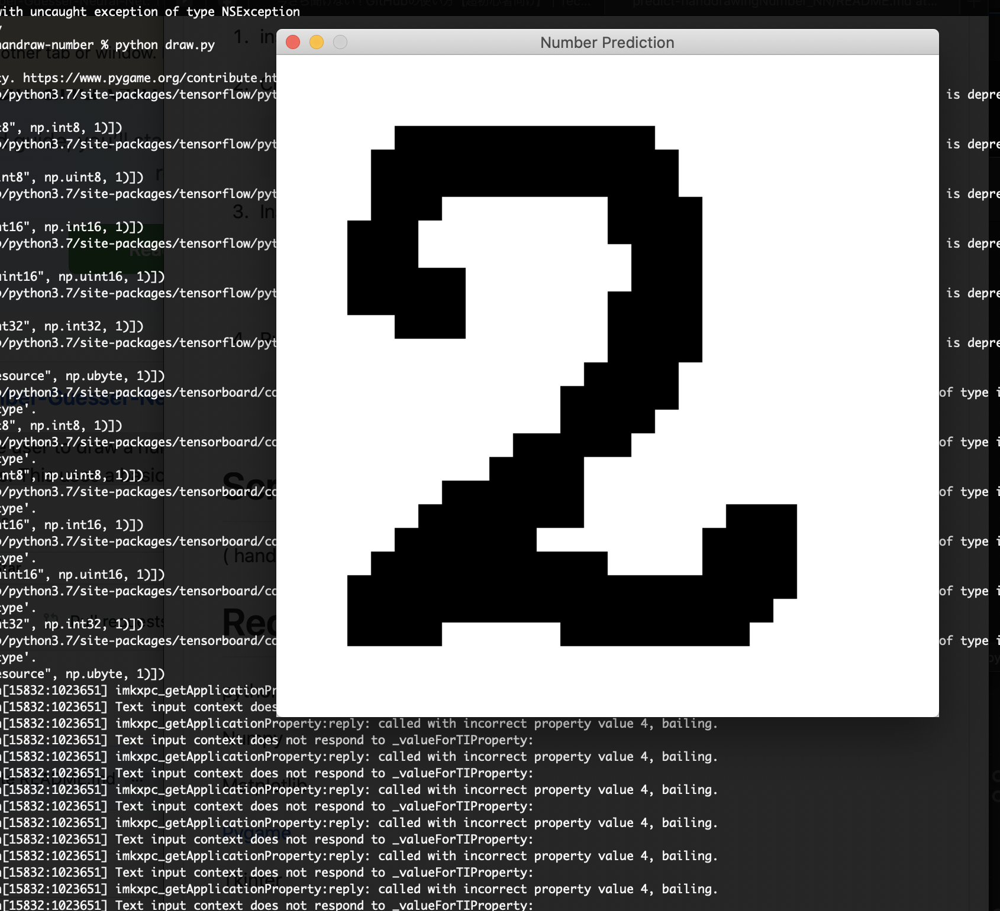

# predicting selfhanddrawing number with simple Neaural Network
This application made using python-[pygame](pygame).

This program allows the user to draw a number on the screen and have the program take a predict of which digit it is. 

This uses a super simple neural network model.
# How to (as tested on MaxOS)
1. install python3.x
1. Clone the repository:
    ```bash
    git clone https://github.com/ozora-ogino/predict-handdrawingNumber_NN/ 
    ```

2. Install python packeges from requirements.txt
    ```bash
    pip install -r requirements.txt
    ```

3. Run draw.py
    ```bash
    python draw.py
    ```
# Screenshot


# Requirements
python3.6

Numpy 

Matplotlib

[Pygame](pygame)

Tkinter

Tensorflow

Keras

[pygame]: http://www.pygame.org
